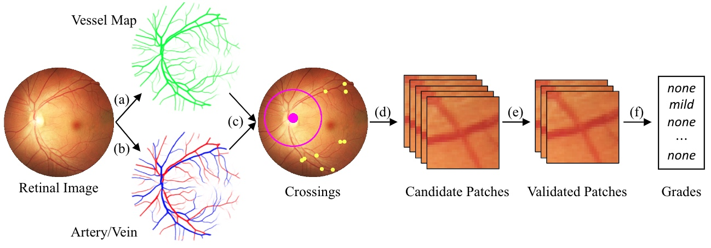
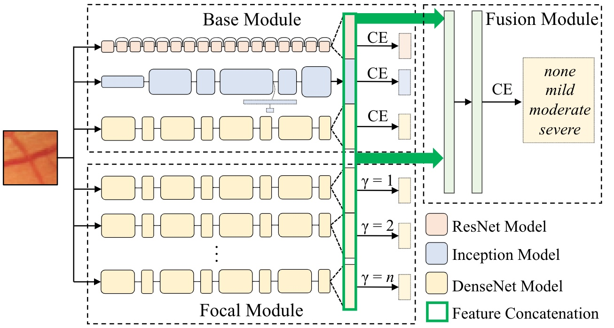

# MDTNet


## Grading the Severity of Arteriolosclerosis from Retinal Arteriovenous Crossing Patterns

## Introduction
The status of retinal arteriovenous crossing is of great significance for clinical diagnosis. As an ophthalmology diagnostic criteria, Scheie's classification has been used to grade the arteriolosclerotic changes in arteriolosclerotic retinopathy. In this paper, we propose a deep learning approach to support the diagnosis process, which, to the best of our knowledge, is one of the earliest attempts in the medical imaging.  We adopt segmentation and classification models to automatically obtain vessels in a retinal image with the corresponding artery/vein labels and find possible arteriovenous crossings. Then we use classification models to validate these crossings and to grade their severity. To better address the problem of ambiguity and unbalance, we propose a new model, named multi-diagnosis team network (MDTNet), in which the sub-models with different structures or different loss functions may provide different decisions. MDTNet unifies these diverse theories to give the final decision with high accuracy. The numerical results demonstrate that our method can achieve a good performance in both arteriovenous crossing validation and severity grading tasks.


Fig.1 Typical examples of our prediction targets. Images in the first and second rows raw retinal patches and automatically-generated vessel maps with manually-annotated artery/vein labels, respectively. Red represents arteries while blue represents veins. (a) is false crossing (the vein runs above the artery), while (b)-(e) are for none, mild, moderate, and severe grades, respectively. Note that the arteriolosclerosis are not very obvious in the vessel maps.



Fig.2 Overall pipeline of our severity grading.

## Model



Fig.3 MDTNet for severity grade prediction.

## Usage

Training, prediction, analysis (validation):

```bash
python crossing_validation(cls).py
```

Training, prediction, analysis (diagonsis):

```bash
python level_dignosis(cls).py
```

Models will be placed at `./saved_model/` and results will be saved at `./results/`.


## Publication

If you want to use this work, please consider citing the following paper.

```
@article{li2020grading,
  title={Grading the Severity of Arteriolosclerosis from Retinal Arterio-venous Crossing Patterns},
  author={Li, Liangzhi and Verma, Manisha and Wang, Bowen and Nakashima, Yuta and Kawasaki, Ryo and Nagahara, Hajime},
  journal={arXiv preprint arXiv:2011.03772},
  year={2020}
}
```

## Acknowledgements

This work was supported by Council for Science, Technology and Innovation (CSTI), cross-ministerial Strategic Innovation Promotion Program (SIP), “Innovative AI Hospital System” (Funding Agency: National Institute of Biomedical Innovation, Health and Nutrition (NIBIOHN)). This work was also supported by JSPS KAKENHI Grant Number 19K10662 and 20K23343.

## License

This project is licensed under the MIT License.
